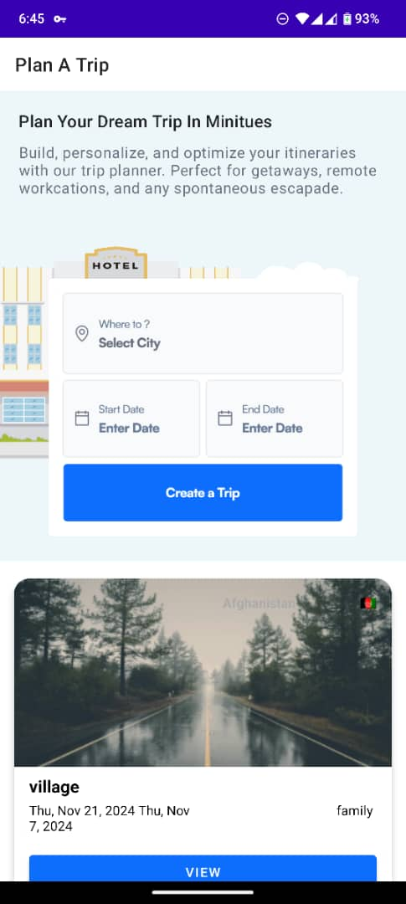
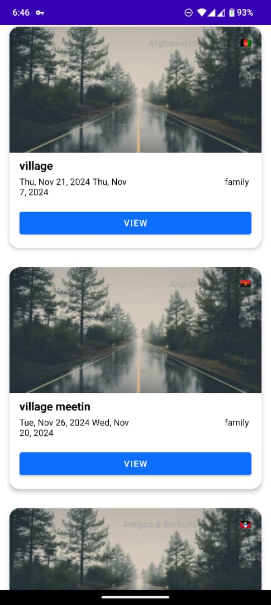
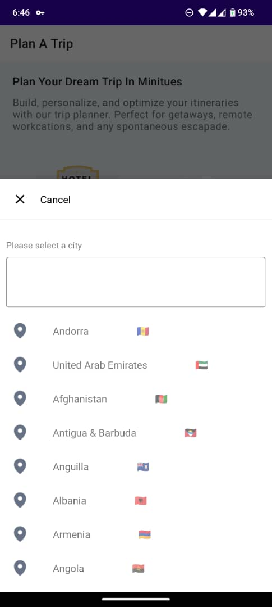
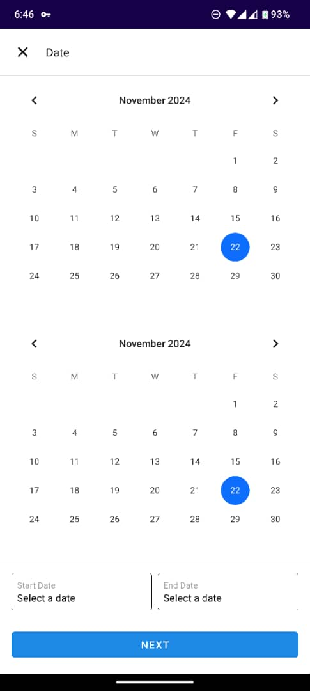
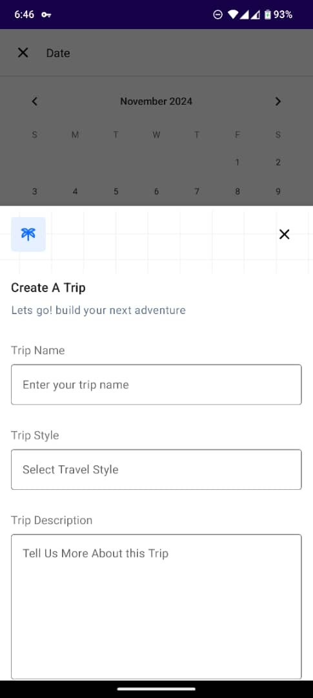
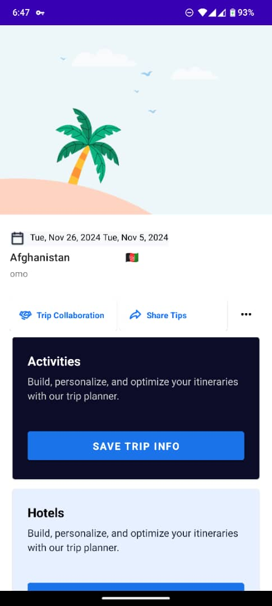

# News App 🗞
[]

Travel Template App is a simple Android app that uses the Beceptor CRUD API to manage travel details. The app allows users to create, fetch travel records, such as trip names, locations, and dates. The main aim of this app is to demonstrate modern Android development practices, using ViewModel, Repository, and LiveData to manage UI-related data and API calls. It also serves as a sample project for best practices in working with network requests, data persistence, and UI architecture.


The codebase focuses 👓 on following key things:
1. [ViewBinding](https://developer.android.com/topic/libraries/view-binding)
2. [Navigation Components](https://developer.android.com/guide/navigation/navigation-getting-started) using Fragments
3. [LiveData](https://developer.android.com/reference/android/arch/lifecycle/LiveData) & [ViewModel](https://developer.android.com/reference/android/arch/lifecycle/ViewModel)
4. [Dagger2](https://developer.android.com/training/dependency-injection/dagger-basics) + [Hilt](https://developer.android.com/training/dependency-injection/hilt-android) - dependency injection
5. [Retrofit](https://square.github.io/retrofit/)
6. [Room](https://developer.android.com/training/data-storage/room)
7. [Paging3](https://developer.android.com/topic/libraries/architecture/paging/v3-overview), [PagingDataAdapter](https://developer.android.com/reference/kotlin/androidx/paging/PagingDataAdapter), [LoadStateAdapter](https://developer.android.com/reference/kotlin/androidx/paging/LoadStateAdapter)
18. [RecyclerView](https://developer.android.com/guide/topics/ui/layout/recyclerview), [ListAdapter](https://developer.android.com/reference/androidx/recyclerview/widget/ListAdapter)
18. [GSON](https://github.com/google/gson)
10. [Kotlin Flow](https://developer.android.com/kotlin/flow)
11. [Material Design](https://material.io/develop/android)
12. [Kotlin Coroutines](https://developer.android.com/kotlin/coroutines)
13. Clean code with Tests
14. Firebase Crashlytics 

The idea is to keep the app super simple while demonstrating new libraries and tools which makes it easier to build high quality Android applications.

# Development Setup 🖥

You will require latest version of Android Studio 3.0 (or newer) to be able to build the app

## API key 🔑
[beeceptor](https://app.beeceptor.com/)  dooes require apikey  but

- Generate an API  (It's only 2 steps!) from [Beaceptor](https://newsapi.org/) or use mine (its public and free )
```
    My Api  = "https://ca9e5bccd99332d54d8a.free.beeceptor.com/api/traveldetail"
```
- Build the app 
- Good Luck 🎉

<h2 align="left">ScreenShots</h2>
<h4 align="start">






<br>

## Architecture

The app uses MVVM [Model-View-ViewModel] architecture to have a unidirectional flow of data, separation of concern, testability, and a lot more.

Read more: 
- [Building Modern Android Apps with Architecture Guidelines](https://medium.com/@aky/building-modern-apps-using-the-android-architecture-guidelines-3238fff96f14)
- [Guide to app architecture](https://developer.android.com/jetpack/docs/guide)


## TODO

### API Endpoints Summary

1. **GET `/api/traveldetail/`**
    - Fetches all trip records.
    - Used to populate the list of trips in the main UI.

2. **GET `/api/traveldetail/{id}`**
    - Retrieves details of a specific trip by ID.
    - Used for viewing trip details in a detailed view or fragment.

3. **POST `/api/traveldetail/`**
    - Creates a new trip.
    - Used in forms to add a new trip.

4. **PUT `/api/traveldetail/{id}`**
    - Updates all fields of an existing trip by ID.
    - Used when editing a trip completely.

5. **PATCH `/api/traveldetail/{id}`**
    - Updates specific fields of a trip by ID.
    - Used for partial edits like changing the trip name or date.

6. **DELETE `/api/traveldetail/{id}`**
    - Deletes a trip by ID.
    - Used for removing trips from the list.


This API is integrated with **Retrofit** to perform CRUD operations, ensuring seamless interaction with the backend for managing travel details.

Some features that needs to be enhanced but didnt due to lack of time 

1) Pager Integration in Api response
2) BackPress in SearchView
3) Loading Animation

## Author
Emmanuel Iyke

## License
This project is licensed under the Apache License 2.0 - See: http://www.apache.org/licenses/LICENSE-2.0.txt
